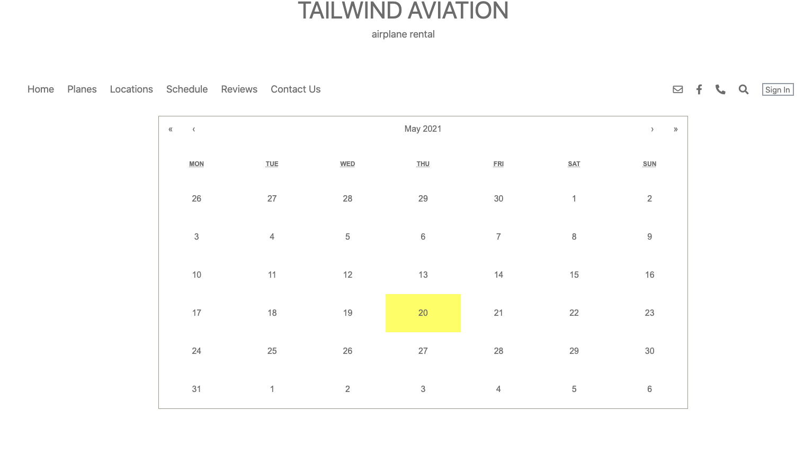
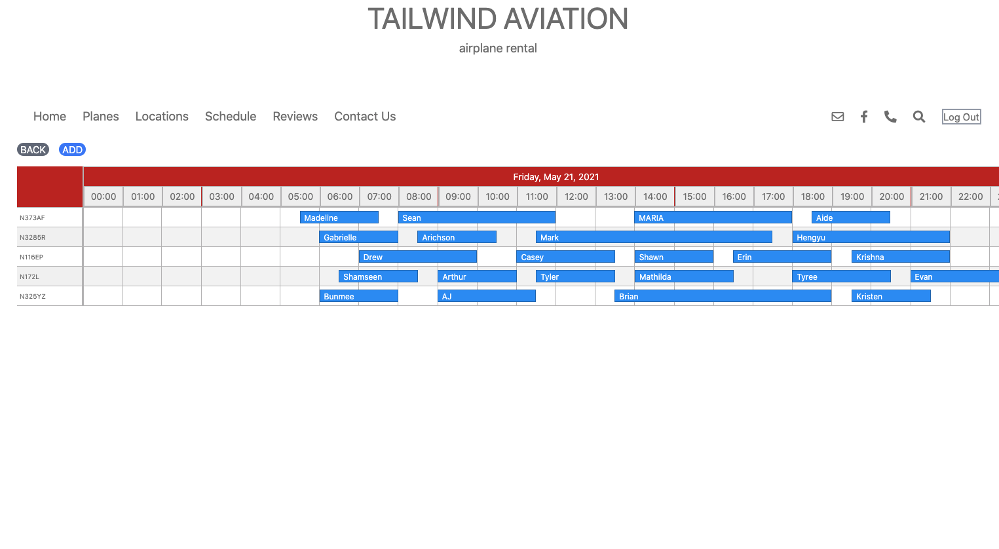
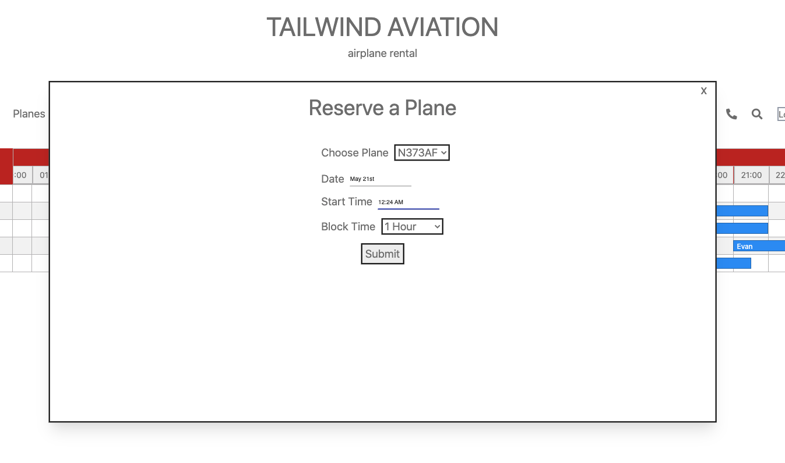
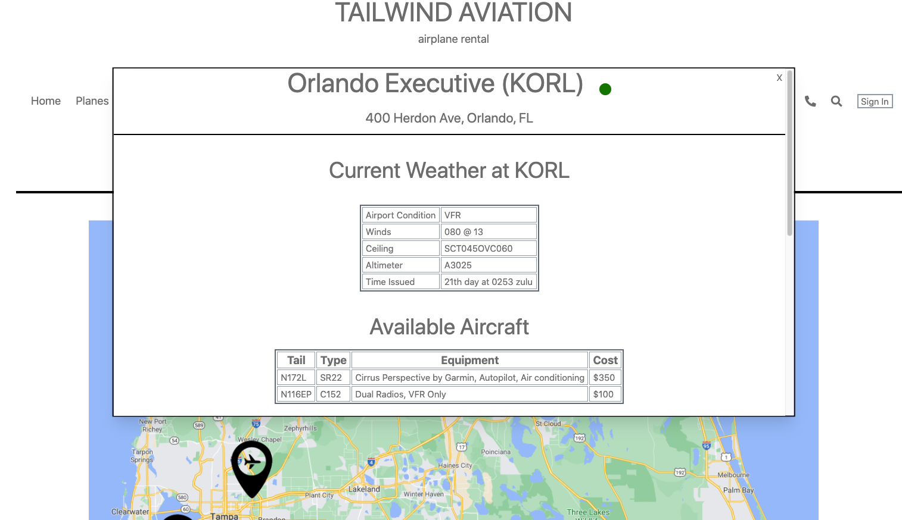

# Tailwind Aviation

Rent a plane for an hour, two hours, or even the whole day! Tailwind aviation is a mock airplane rental company. Make an account, login, and travel to a new destination!
Live link here https://tailwind-aviation.netlify.app/

## Motivation
With my background in aviation, I have rented aircraft from multiple different places. I was inspired by a particular website, that lacked modern styling and features. There had to be a better way to set up scheduling.

## Build Status
Currently, anyone can quickly see availability in real time. Once a user registers, they are able to reserve a spot if available. The website is only missing the ability to handle billing and payments, which will not be added since this is a mock up site. 

## Tech/framework used
1. React
2. Javascript
3. tailwind Css
4. Material-ui
5. Material-ui/pickers
6. moment js
7. react-calendar
8. react-calendar-timeline
9. react-responsive-carousel
10. craco
11. tailwindcss

## Features
The site contains user authentication. New Users can register for an account, or returning users can log into their account. Once logged in, the add to calendar button becomes visible. The user can now go in and add to the schedule.   

     

    

       

If the schedule is already full, the front end provides a validation check. The user will be alerted that the selected time is already booked.   
There is a locations page with information about each airport. The AVWX api provides current aviation weather for each airport. This makes it easier for pilots to get a general idea about the current weather picture. The dot next to the Airport name will change color according to the aviation flight conditions.  
1. Green - VFR (Visual Flight Rules)
2. Blue - MVFR (Marginal Visual Flight Rules)
3. Red - IFR (Instrument Flight Rules)
4. Purple - LIFR (Low Instrument Flight Rules)    

More on this here https://www.thinkaviation.net/levels-of-vfr-ifr-explained/ if interested.   

    

On the plane info page, it contains the 5 mock aircraft used in this build. Each image is a link to a detailed page for each aircraft. Each detailed page contains multiple photos and info about the aircraft (Tail number, Type, Equipment, Cost per Hour)

## Installation
Fork and clone this repository. Run yarn add to install dependencies. All image files are included in the repository.

## License
&copy; tjconti12

